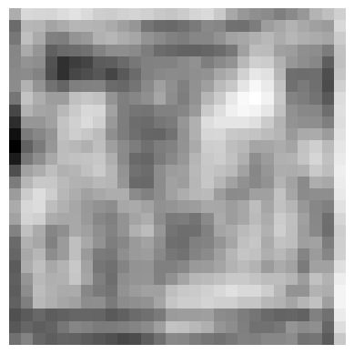
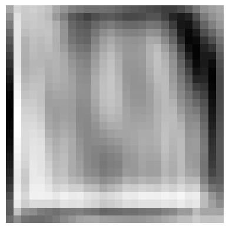

## VOGAN

A 2.8 million parameter GAN I built from scratch in PyTorch to generate FashionMNIST images. This follows the standard GAN formulation based on trying to minmax the Jensen-Shannon Divergence (JSD) using binary cross entropy as our loss function for both the generator and the discriminator.

## Results

### Losses

On epoch 10 the generator and discriminator losses were 0.08 and 0.02 respectively. There is probably some mode collapse going on here, but I don't have the hardware to train this for 500 epochs with more noise.

- **Epoch 0**:

  Generator has no idea what it's doing

  

- **Epoch 10**:

  Generator seems to be generating some kind of pattern

  

It does seem to be learning to make shirts or coats. So, it is probably working, and training it for longer with more noise would probably yield better results.

## Models

The models have been saved in the `models` folder. The generator and discriminator are saved as `generator.pth` and `discriminator.pth` respectively.

## Ref:

- Architecture: [nicknochnack](https://github.com/nicknochnack)
